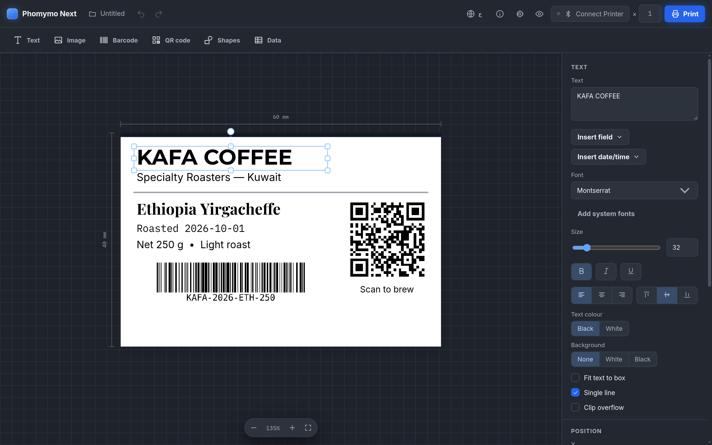
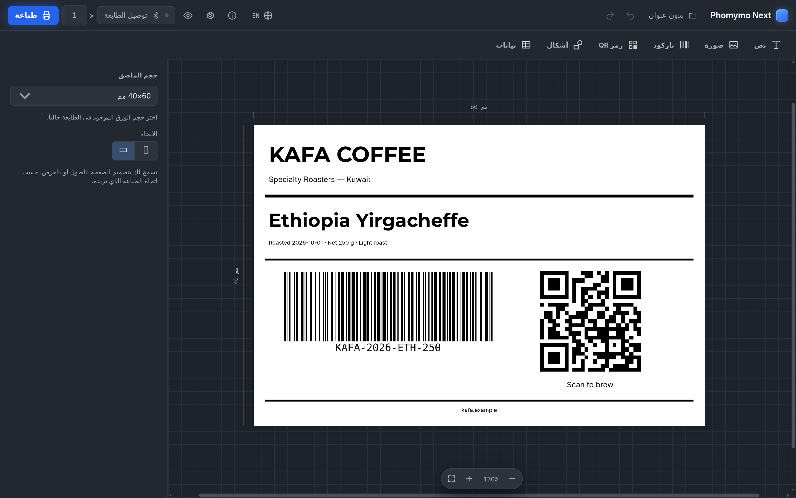
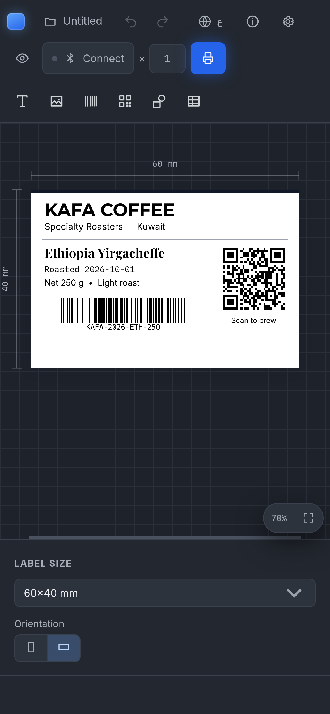

<div align="center">

# Phomymo Next

**A label designer for Phomemo thermal printers — in your browser, in Arabic and English.**

[](LICENSE)
[](https://github.com/Lojs/phomymo-next/releases/latest)
[](https://github.com/Lojs/phomymo-next/pkgs/container/phomymo-next)

Text, images, barcodes, QR codes, shapes, multi-label rolls, and CSV batch
printing — designed on screen and printed straight from the browser over
Bluetooth or USB.

</div>

---

## Screenshots

<div align="center">



<sub>Designing a 60×40 mm coffee label — text, rules, a CODE128 barcode and a QR code</sub>

<br><br>



<sub>The same design in Arabic — the entire interface mirrors to right-to-left</sub>

<br><br>

<table>
<tr>
<td width="50%"></td>
</tr>
<tr>
<td align="center"><sub>On a phone the inspector becomes a bottom sheet</sub></td>
</tr>
</table>

</div>

---

## Features

- **Real label sizes** — 12 presets, round labels, continuous tape, or any custom size in millimetres. The size you pick *is* the paper in the printer.
- **Portrait and landscape** on any rectangular label; switching rotates the whole design as one piece.
- **Bluetooth and USB** — print width, DPI and alignment come from the printer model. 18 built-in definitions, plus your own.
- **Batch printing** — one design, many records, from a CSV or the in-app table, with `{{fields}}` and `[[expressions]]`.
- **Print preview** — images shown as they will actually dither on paper, while text and barcodes stay crisp.
- **Import / export** — designs as JSON, PNG or PDF; data as CSV.
- **Arabic and English** — a real right-to-left layout, not a translation layer.

---

## Requirements

Printing uses the **Web Bluetooth** and **WebUSB** APIs, which work **only in
Chrome or Edge** and **only in a secure context** — HTTPS, or
`http://localhost`. That is why the container serves the app over HTTPS.

- **Windows, Linux, Android** — Chrome or Edge. On Windows, use Bluetooth: USB
  usually fails with "Permission denied" because Windows binds the printer to its
  own kernel-mode driver (*USB Printing Support*), and reclaiming the interface
  needs a manual WinUSB override. On Linux USB works normally.
- **macOS** — Chrome and Edge on macOS do implement both APIs, so they print.
  Safari does not implement Web Bluetooth or WebUSB, so it cannot.
- **iOS and iPadOS** — no browser can print.

Designing, the CSV template table, and export all work everywhere.

> **The certificate is self-signed.** The browser warns once; click through it
> and the origin counts as secure, so printing works. Installing the app as a PWA
> needs a certificate the browser already trusts — see below.

---

## Quick start

```sh
cp .env.example .env        # set PHOMYMO_DOMAIN for LAN access
docker compose up -d --build
```

Open **https://localhost:8444**. Only one port is published, so always use
`https://` and the port explicitly.

To reach it from another device, put this machine's LAN address in `.env` as
`PHOMYMO_DOMAIN=192.168.1.50` and run `docker compose up -d`.

<details>
<summary>Using your own certificate</summary>

Copy `cert.pem` and `key.pem` into `./phomymo-certs/`, then
`docker compose restart`. The container leaves a certificate it did not
generate alone.

</details>

---

## Commands

| Action | Command |
|---|---|
| Start (builds if needed) | `docker compose up -d --build` |
| Start without rebuilding | `docker compose up -d` |
| Stop | `docker compose down` |
| Logs | `docker compose logs -f` |
| Check it's running | `docker compose ps` |

---

## Where your data lives

The only thing kept on the server is the HTTPS certificate, in
`./phomymo-certs`. Everything else — designs, settings, printer memory, template
data — lives in your browser's `localStorage`, per device and per browser.
Clearing site data or switching browser starts from empty, so export anything you
want to keep.

---

## Local development

```sh
npm install
npm run dev         # http://localhost:5173 — localhost is a secure context, so BLE/USB work here
npm run build       # production build into dist/
npm test            # unit and golden tests
npm run test:ci     # the same, plus coverage thresholds — what CI runs
npm run typecheck
```

**1373 tests** across 62 files. Many are **golden tests**: they compare this
rewrite's output byte-for-byte against a frozen copy of the original
implementation in `tests/legacy/`, so a refactor cannot quietly change what
reaches the paper.

`src/core/` is framework-free logic — protocols, rasterisation, the data model,
templates — with no React and no browser APIs beyond `canvas`, which is what
makes that possible. `src/transport/` is Web Bluetooth and WebUSB,
`src/state/` the store, `src/services/` print orchestration, `src/ui/` React,
`src/i18n/` the dictionaries, `docker/` the HTTPS packaging.

---

## Credits

Derived from
[transcriptionstream/phomymo](https://github.com/transcriptionstream/phomymo),
which established the hard parts: the Phomemo print protocols, the raster and
dithering pipeline, and the printer definitions. `tests/legacy/` keeps a frozen
copy of it so the golden tests can assert byte-identical output. See
[NOTICE](NOTICE) for full attribution.

---

## Licence

Released under the [MIT Licence](LICENSE).

Copyright © 2026 Lojs

<p align="center">
  <sub>Made with patience, in Kuwait.</sub>
</p>